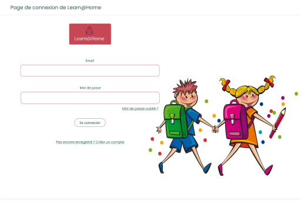

# Learn@Home

## Definition of needs and modeling of a technical solution for a school support association - agile methodology

### Scenario

Learn@Home is an association which connects children with academic difficulties with volunteer tutors. \
Operating mainly through word of mouth and SMS, it now wants to have a complete website. \
We must therefore frame the project and offer them a solution.

## Deliverables

### Use case diagrams for each of the major functionalities of each page (no UML needed)

[view PDF file](./Learn@Home_use-case-diagrams.pdf)

### User stories with acceptance criterion(s) for each functionality

[view PDF file](./Learn@Home_user-stories.pdf)

### Site models

[view PDF file](./Learn@Home_models.pdf)

### Kanban

[view PDF file](./Learn@Home_Kanban.pdf)